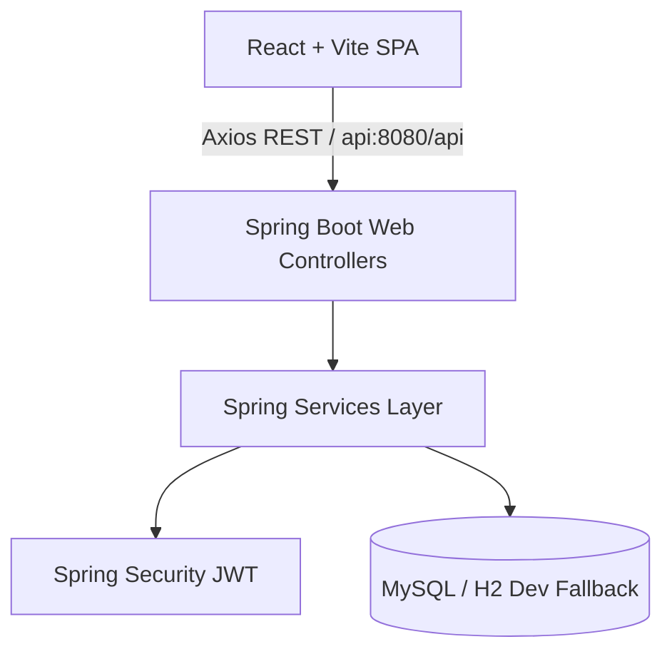

# Walkthrough - TaskFlow (Decoupled & Simplified REST Client)

TaskFlow is an ultra-modern, startup-grade full-stack task management SaaS platform inspired by industry leaders like Linear, Vercel, Stripe, and Framer. It provides teams with a unified, high-performance, glassmorphic work-operating system.

---

## 🏗️ Architecture & High-Performance REST Sync Engine

TaskFlow utilizes a premium decoupled architecture designed for high scalability, modern looks, and fault tolerance:



### ⚡ Seamless REST-based Workspace Sync
- **Local State Updates (Zero-Lag UI):** All user interactions (e.g. creating a task, dragging cards, editing metadata, adding comments) are instantly applied to the local Zustand state and synced via standard HTTP/REST requests, ensuring zero-lag user experience.
- **Resilient Periodic Synchronization:** A background synchronization engine polls the REST API every 10 seconds, automatically keeping dashboards, Kanban boards, and notifications hydrated with updates from other team members.

---

## 🎨 Premium Design System & UI/UX Showcases

The application was crafted with deep visual polish, eschewing standard layouts for a luxurious, immersive product feel:
- **Base Background:** Zinc black (`#030303`) with interactive radial mesh gradients (`rgba(99, 102, 241, 0.1)`) that pulse in response to user state.
- **Glassmorphism:** Frost blurred backdrops (`backdrop-blur-md bg-white/5 border border-white/10`) that mimic translucent glass, creating rich layer depth.
- **Micro-Animations:** Fluid transitions powered by **Framer Motion** that bounce slightly upon expansion, sliding, or modal popups.

### 🌟 Main Screen Modules

#### 1. Collapsible Glassmorphic Sidebar & Active Crew
- Fully collapsable with responsive layout springs.
- Displays active multi-tenant workspaces, quick navigations, and an **Active Crew** roster detailing online handles and roles.

#### 2. Top Navigation Bar & Notification popovers
- Integrated quick-search triggers.
- Dynamic **Inbox notification drawer** displaying active mentions and assignments.

#### 3. Raycast-style Command Menu (`Ctrl + K`)
- Triggers a keyboard-navigable search modal.
- Users can instantly swap dashboards, jump to workspaces, or look up items from anywhere in the app with rapid key binds.

---

## 📊 Feature Breakdown

### Tab 1: Executive Control Mesh (Analytics)
Renders high-fidelity data visualizations to help managers optimize their workflow:
- **Team Activity Waves:** A customized Recharts `AreaChart` with deep purple-indigo glow effects mapping hourly productivity averages.
- **Sprint Completion Velocity:** A Recharts `BarChart` comparing weekly story points achieved against completed counts.
- **Workspace Activity Audit Feed:** A scrollable, real-time audit ledger detailing every action taken in the workspace.

### Tab 2: Collaborative Kanban Stream
An agile drag-and-drop board supporting immediate positional recalculations:
- Divided into status columns: `Backlog`, `In Progress`, `In Review`, and `Done Scope`.
- Supported by native HTML5 drag-and-drop. Dragging cards tilt slightly and dropping them automatically synchronizes their positions with the database.

### Tab 3: Structured Inventory List
A high-density list layout for rapid data entry and management:
- Allows quick keyword searching, inline status and priority selection, and instant delete controls.

---

## ⚡ Usability & Frictionless Interactions

TaskFlow prioritizes speed and simplicity, implementing direct entry controls that reduce the time and effort required to organize workflows:

1. **⚡ Frictionless Inline Quick-Add Input:** Placed at the top of all dashboard views. Users can type a task name and press `Enter` to instantly add a task under default settings, eliminating the need to navigate complex forms for simple tasks.
2. **➕ Column-Header Status Shortcuts:** A quick `+` trigger is positioned on each Kanban column header. Clicking it opens the task creator with that column's status already selected.

---

## 🚀 Setup & Launch Checklist

1. **Spin up Infrastructure:**
   ```bash
   docker-compose up -d
   ```
2. **Launch Spring Boot Backend:**
   ```bash
   cd backend
   mvn spring-boot:run
   ```
3. **Launch React Frontend:**
   ```bash
   cd frontend
   npm run dev
   ```

---

## 🛠️ Simplicity & WebSocket Decoupling

### 1. WebSocket Removal & REST Streamlining
- **Backend Refactor:** Completely removed `@EnableWebSocketMessageBroker` and `WebSocketConfig.java`. Discharged `SimpMessagingTemplate` autowired injections and broadcasting hooks from `TaskService.java`, `CommentService.java`, and `NotificationService.java`.
- **Frontend Refactor:** Removed all socket handles, native STOMP frames, subscriptions, and WebSocket lifecycle listeners in `App.jsx`.
- **Store Evolution:** Transformed `useTaskStore.js` and `useNotificationStore.js` into self-updating REST clients. Creating, moving, updating, or deleting tasks instantly updates the local state on API success, with periodic background REST synchronization providing server changes.

### 2. Roster & Assignee TypeError Resolution
- **Issue:** The dashboard crashed on load with `Uncaught TypeError: Cannot read properties of undefined (reading 'username')` when rendering the crew sidebar or task modals.
- **Fix:** Refactored `MainDashboard.jsx` to correctly map the workspace member roster and task modal select options directly using flat `WorkspaceMemberDTO` keys returned by the backend.

### 3. Programmatic Development Seeding (`DatabaseSeeder.java`)
- **Enhancement:** Developed a Spring `CommandLineRunner` seeder that executes automatically when the H2 database starts up empty in `dev` profile.
- **Hydrated Data:** Provisions complete premium startup sandboxes (Users like `alice@taskflow.ai` / `password123`, multiple multi-tenant workspaces, Kanban cards, check-lists, comments, and recent activities).
